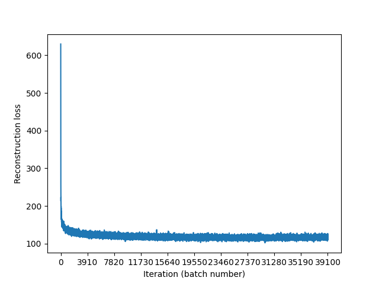
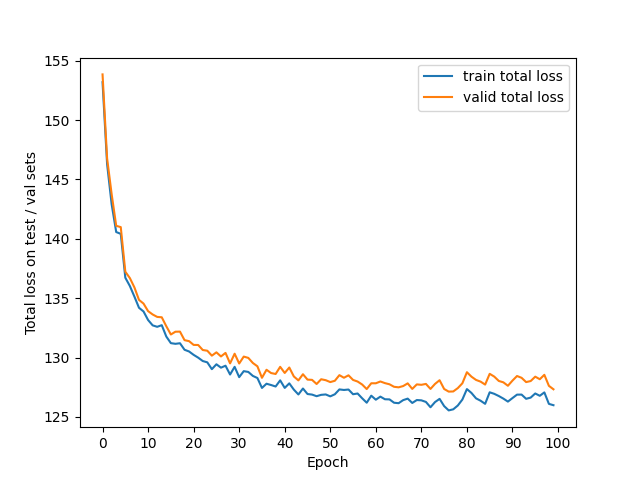
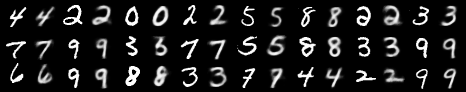
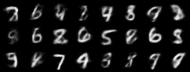

# Discrete Variational Autoencoder (DVAE) with restricted Boltzmann machine

## Overview
The purpose of this project is to implement Discrete Variational Autoencoder (DVAE) model
with restricted Boltzmann Machine based on the description presented in [DVAE](https://arxiv.org/abs/1609.02200) paper and in the first half of the [QVAE](https://arxiv.org/abs/1802.05779) paper.

## Dataset
MNIST dataset is used.

## Model
Discrete Variational Autoencoder model is implemented based on the description presented in [DVAE](https://arxiv.org/abs/1609.02200) paper and in the first half of the [QVAE](https://arxiv.org/abs/1802.05779) paper.\
Hyperparameters are not optimized.

## Implementation
The model is implemented using PyTorch library.

## Usage
```bash
python main.py
```

## Results
-LL <= -ELBO = Reconstruction loss + KL-divergence = Total loss -> min
### Reconstruction loss graph

### Total loss graph

### Examples of image reconstruction

### Examples of image generation


## Further steps
To obtain more accurate total loss values increase number of samples and number of intermediate distributions for annealed importance sampling used for estimating the logarithm of RBM partition function, also for obtaining better results consider increasing number of samples per batch during training and experimenting with other hyperparameters.
